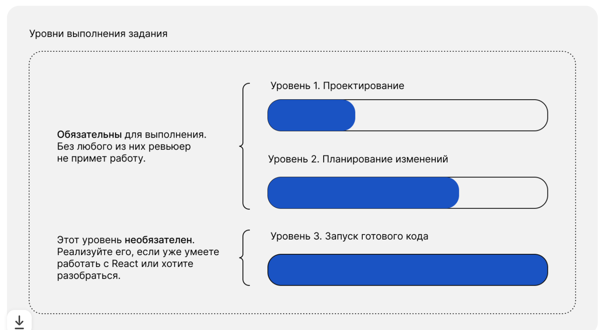
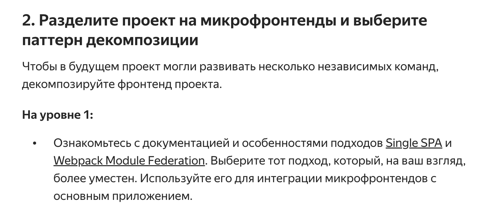
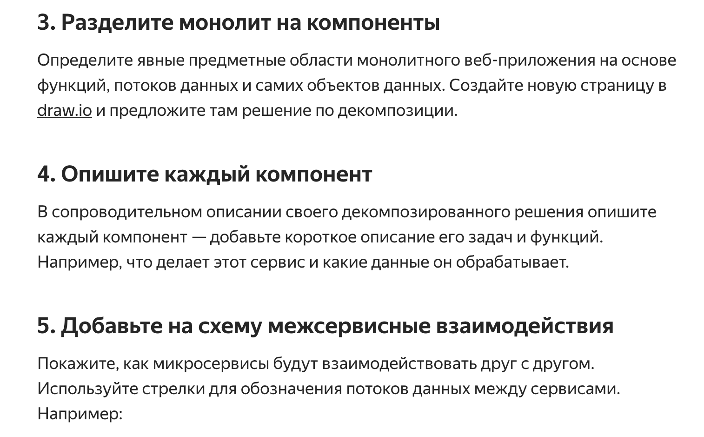

<h1>Решение заданий, Sprint 1 - Микрофронтенды и 
разбивка монолитной системы на микросервисы</h1>

ниже задача Спринта 1



<h2>Задание 1 - Уровень 1. Проектирование</h2>
<hr>



**<h3>Исходим из следующих положений (нам нужно):</h3>**

* разделить проект на независимые модули с минимальным дублированием кода
* легко реиспользовать общие модули между микрофронтендами.

* **Пример использования:** микрофронтенд для профиля и для работы с фотографиями может использовать одни и те же общие компоненты, такие как кнопки, хидер/футер, карточки (было в описании проекта Место, но нет в коде).

**<h3>Решение</h3>**

Мы выбрали подход с использованием Webpack Module Federation для разделения фронтенда на микрофронтенды. Это хороший выбор для вашего случая, когда модули должны быть автономными и разработка ведется разными командами. Я помогу вам структурировать проект, включая разделение компонентов, стилей и утилит, и составить план для внедрения микрофронтендов.

Задание: Разделение проекта на микрофронтенды с использованием Webpack Module Federation

1. Создание структуры проекта

Для начала создадим отдельные микрофронтенды для каждой функциональной части вашего приложения:

	1.	auth-microfrontend — Микрофронтенд для аутентификации
	2.	profile-microfrontend — Микрофронтенд для управления профилем
	3.	photo-microfrontend — Микрофронтенд для работы с фотографиями (загрузка, удаление, лайки)

также далее добавим микрофронтенды для общего использования - header and footer

    4. shared-microfrontend (общие компоненты, такие как Footer и Header)

Каждый микрофронтенд будет независим и включать свои компоненты, стили и утилиты.

Пример структуры для auth-microfrontend - будет на порте 3000:

```
/auth-microfrontend
├── /src
│   ├── /components
│   │   ├── Login.js      # Компонент входа пользователя
│   │   ├── Register.js   # Компонент регистрации пользователя
│   ├── /styles
│   │   ├── login.css     # Стили для компонента входа
│   │   ├── register.css  # Стили для компонента регистрации
│   ├── /utils
│   │   └── auth.js       # Утилиты для аутентификации
│   ├── index.js          # Точка входа микрофронтенда
├── package.json          # Зависимости и скрипты микрофронтенда
└── webpack.config.js     # Конфигурация Webpack
```
Expose: ./Login and ./Register

пример файла webpack.config.js может быть таким

```
// webpack.config.js

const { ModuleFederationPlugin } = require('webpack').container;
const path = require('path');

module.exports = {
  entry: './src/index.js',
  mode: 'development',
  devServer: {
    port: 3001,
  },
  output: {
    publicPath: 'http://localhost:3001/',
  },
  plugins: [
    new ModuleFederationPlugin({
      name: 'auth',
      filename: 'remoteEntry.js',
      exposes: {
        './Login': './src/components/Login.js',
        './Register': './src/components/Register.js',
      },
      shared: { 
        react: { singleton: true }, 
        'react-dom': { singleton: true },
      },
    }),
  ],
};
```

* name: Имя микрофронтенда, которое будет использоваться при его подключении.
* exposes: Указывает, какие модули (компоненты) доступны для использования другими микрофронтендами.
* shared: Общее использование зависимостей, чтобы избежать дублирования библиотек, таких как React.

<h4>1.1. Интеграция микрофронтендов</h4>

Основное приложение (или host application) будет подключать все микрофронтенды с использованием Webpack Module Federation. 
Например, для подключения аутентификационного микрофронтенда:

```
// host webpack.config.js

const { ModuleFederationPlugin } = require('webpack').container;

module.exports = {
  entry: './src/index.js',
  mode: 'development',
  devServer: {
    port: 3000,
  },
  plugins: [
    new ModuleFederationPlugin({
      name: 'host',
      remotes: {
        auth: 'auth@http://localhost:3001/remoteEntry.js',
        profile: 'profile@http://localhost:3002/remoteEntry.js',
        photo: 'photo@http://localhost:3003/remoteEntry.js',
      },
      shared: { 
        react: { singleton: true }, 
        'react-dom': { singleton: true },
      },
    }),
  ],
};
```
Аналогично мы можем подключить любой компонент из других микрофронтендов (на примере Login):

```
// Использование компонента Login из auth-microfrontend

import React from 'react';
import Login from 'auth/Login';

function App() {
  return (
    <div>
      <h1>Main Application</h1>
      <Login />
    </div>
  );
}

export default App;
```

<h4>1.2. Установка и запуск:</h4>
* •	Установка зависимостей: npm install
* •	Запуск в режиме разработки: npm start

Пример для auth-microfrontend:

```
# Auth Microfrontend

Микрофронтенд, отвечающий за аутентификацию пользователя (вход и регистрация).

## Установка и запуск

```bash
npm install
npm start
```
<h4>1.3. Еще про микро-фронтенды и общие компоненты</h4>

shared-microfrontend (общие компоненты, такие как Footer и Header)

Этот микрофронтенд будет содержать общие компоненты, которые могут использоваться в разных частях приложения, такие как Footer.js и Header.js. Это важно для повторного использования общих элементов на всех страницах.

Структура для shared-microfrontend:

```
/shared-microfrontend
├── /src
│   ├── /components
│   │   ├── Header.js         # Компонент для заголовка страницы
│   │   ├── Footer.js         # Компонент для футера
│   ├── /styles
│   │   ├── header.css        # Стили для заголовка
│   │   ├── footer.css        # Стили для футера
│   ├── index.js              # Точка входа микрофронтенда
├── package.json              # Зависимости и скрипты микрофронтенда
└── webpack.config.js         # Конфигурация Webpack
```

Header.js и Footer.js будут компонентами, которые могут быть импортированы в любой 
микрофронтенд для отображения заголовка и нижнего колонтитула:

пример реализации (или из репозитория)

```
// src/components/Header.js

import React from 'react';

function Header() {
  return (
    <header className="header">
      <h1 className="header__title">Mesto</h1>
    </header>
  );
}

export default Header;
```

аналогично можно для Footer

Webpack конфигурация для shared-microfrontend будет такой же, как для других микрофронтендов, 
но с акцентом на предоставление общих компонентов:

```
// webpack.config.js

const { ModuleFederationPlugin } = require('webpack').container;
const path = require('path');

module.exports = {
  entry: './src/index.js',
  mode: 'development',
  devServer: {
    port: 3004, // Уникальный порт для shared-microfrontend
  },
  output: {
    publicPath: 'http://localhost:3004/',
  },
  plugins: [
    new ModuleFederationPlugin({
      name: 'shared',
      filename: 'remoteEntry.js',
      exposes: {
        './Header': './src/components/Header.js',
        './Footer': './src/components/Footer.js',
      },
      shared: {
        react: { singleton: true },
        'react-dom': { singleton: true },
      },
    }),
  ],
};
```

Каждый микрофронтенд автономен и может использовать Webpack Module Federation для обмена компонентами, 
такими как заголовок и футер, с другими частями приложения. Компоненты будут работать независимо, 
и разные команды могут работать над ними параллельно.

пример ниже - у нас будет и Header вверху страницы, 
и Footer внизу, что создаст полную структуру страницы с заголовком и нижним колонтитулом.

```
// Подключение компонентов Header и Footer из shared-microfrontend

import React from 'react';
import Header from 'shared/Header';
import Footer from 'shared/Footer';

function Main() {
  return (
    <div>
      <Header />
      <main>
        <p>Контент главной страницы...</p>
      </main>
      <Footer />
    </div>
  );
}

export default Main;
```

Также дополнительно опишу куда пойдут Card, 
Image и другие страницы. Например в photo-microfrontend, который может выглядеть вот так

```
/photo-microfrontend
├── /src
│   ├── /components
│   │   ├── Card.js           # Компонент для отображения карты с фотографией
│   │   ├── AddPlacePopup.js  # Компонент для добавления новой карты (фотографии)
│   │   ├── ImagePopup.js     # Компонент для просмотра фото в модальном окне
│   ├── /styles
│   │   ├── card.css          # Стили для компонента карточки
│   │   ├── addPlacePopup.css # Стили для добавления новой фотографии
│   │   ├── imagePopup.css    # Стили для модального окна с изображением
│   ├── /utils
│   │   └── api.js            # Утилиты для работы с API для фотографий (получение, удаление, лайки)
│   ├── index.js              # Точка входа микрофронтенда
├── package.json              # Зависимости и скрипты микрофронтенда
└── webpack.config.js         # Конфигурация Webpack
```
<h2>Задание 2 - Уровень 2. Планирование изменений</h2>
<hr>

Само задание

В этом задании вам нужно декомпозировать 
веб-приложения на Django на микросервисы. Вам нужно разбить её на сервисы, используя подход Domain-Driven Design.



**<h3>Решение - разбивка на монолит и описание</h3>**
<hr>     

примерные бизнес-требования к системе (т к я более про аналитику, чем программировние :) )

<h4>Электронная площадка для торговли товарами и услугами</h4>

<h3>Бизнес-требования к системе:</h3>

1. Регистрация и аутентификация пользователей

Описание бизнес-процесса:
Система должна предоставлять пользователям возможность зарегистрироваться, указав необходимые данные, 
такие как имя пользователя, адрес электронной почты и пароль. 
После регистрации пользователи могут авторизоваться для получения доступа к личным кабинетам. 
Сеансы пользователей должны быть защищены и управляться, чтобы обеспечивать безопасность и удобство использования.

Требования:

* Пользователь может зарегистрироваться с уникальными учетными данными.
* Пользователь должен иметь возможность авторизоваться и получить доступ к системе.
* Должен быть предусмотрен механизм восстановления пароля и сброса учетной записи.
* Необходима система управления сессиями для обеспечения безопасности.

2. Управление профилем пользователя

Описание бизнес-процесса:
После успешной регистрации пользователь должен иметь возможность управлять своим профилем. Это включает редактирование персональной информации, такую как имя, адрес электронной почты и другие данные. Также должна быть возможность обновления ролей и управления привилегиями для пользователей с разными уровнями доступа (например, покупатели, продавцы, администраторы).

Требования:

* Пользователь может обновлять информацию своего профиля.
* Система должна поддерживать роли пользователей (например, покупатель, продавец, администратор).
* Необходимо хранить историю изменений профиля и возможность для пользователя изменять настройки.

3. Создание и управление заказами

Описание бизнес-процесса:
Пользователи должны иметь возможность создавать заказы, добавляя в них товары или услуги, доступные на платформе. После создания заказа система должна управлять его статусом, позволяя пользователю видеть актуальное состояние (например, “новый”, “оплаченный”, “доставлен”). В случае необходимости пользователь может отменить заказ, если он еще не был обработан.

Требования:

* Пользователь может создавать заказы, добавляя товары или услуги в корзину.
* Система должна управлять статусом заказа на каждом этапе (новый, оплаченный, отмененный и т.д.).
* Пользователь должен иметь возможность просматривать историю своих заказов.
* Необходима поддержка отмены заказа и уведомление о текущем статусе.

4. Управление товарами и услугами

Описание бизнес-процесса:
Продавцы должны иметь возможность добавлять, редактировать и удалять товары и услуги, которые они предлагают на платформе. Каждый товар или услуга должны иметь уникальное описание, цену и статус (например, “в наличии” или “отсутствует”). Покупатели должны иметь возможность просматривать эти товары и услуги, а продавцы — управлять наличием и актуализацией предложений.

Требования:

* Продавец может добавлять новые товары или услуги на платформу.
* Система должна позволять редактировать характеристики товаров (название, описание, цену, статус наличия).
* Пользователи должны иметь доступ к актуальной информации о наличии товара.
* Необходимо обеспечить возможность удаления товара или услуги, если они больше не предлагаются.

5. Обработка платежей

Описание бизнес-процесса:
Система должна поддерживать возможность оплаты заказов через интегрированные платежные сервисы. Пользователь должен иметь возможность выбрать способ оплаты, и система должна корректно обработать транзакцию, сообщая о ее статусе (успешная, неудачная, отмененная). В случае успешного платежа статус заказа должен быть обновлен автоматически. Пользователю должно быть предоставлено уведомление о завершении операции.

Требования:

* Система должна поддерживать несколько способов оплаты для удобства пользователей.
* Оплата заказа должна инициироваться и подтверждаться через внешние платежные сервисы.
* Пользователи должны быть уведомлены о результате платежа (успешен, неудачен, отменен).
* В случае успешного платежа статус заказа должен быть обновлен.

6. Управление апелляциями и спорами

Описание бизнес-процесса:
В случае возникновения проблем (например, с заказом или доставкой товара), пользователи должны иметь возможность подать апелляцию или запрос на возврат средств. Система должна предоставлять инструмент для подачи жалоб, которые рассматриваются администраторами. По завершении процесса пользователь должен быть уведомлен о результатах рассмотрения апелляции.

Требования:

* Пользователь может подать апелляцию или жалобу по поводу заказа или услуги.
* Администратор должен иметь возможность рассматривать и обновлять статус апелляции.
* Пользователи должны быть уведомлены о статусе апелляции и конечном решении.
* Система должна хранить историю всех апелляций и действий по ним.

7. Уведомления о событиях

Описание бизнес-процесса:
Система должна обеспечивать пользователей актуальной информацией о событиях, связанных с их действиями на платформе. Это может быть уведомление о смене статуса заказа, успешной оплате, изменениях в профиле или завершении рассмотрения апелляции. Уведомления должны быть отправлены по электронной почте или через интерфейс системы.

Требования:

* Пользователи должны получать уведомления о событиях, связанных с их действиями (например, статус заказа, результаты апелляции).
* Система должна поддерживать несколько способов отправки уведомлений (email, push-уведомления).
* Необходимо обеспечить управление шаблонами уведомлений для различных типов событий.
* Уведомления должны быть отправлены своевременно и корректно отображать текущий статус.

<h3>Описание микросервисов:</h3>

1. Authentication Microservice (Микросервис аутентификации)

**Задачи:**

* Регистрация пользователей.
* Аутентификация (вход в систему).
* Управление сессиями пользователей (создание, обновление, завершение).

Взаимодействия:

* Работает с базой данных пользователей для хранения учетных данных.
* Передает токены сеансов другим микросервисам для проверки авторизации пользователя.
* Связан с User Profile Microservice для доступа к профилям пользователей.

**Данные:**

* Сохраняет информацию о пользователях: уникальный идентификатор, имя пользователя, электронная почта, зашифрованный пароль.
* Данные сессий: идентификатор сессии, токен сеанса (например, JWT), время истечения сессии.

2. User Profile Microservice (Микросервис управления профилем пользователя)

**Задачи:**

* Управление профилем пользователя (редактирование имени, электронной почты, аватара и т.д.).
*  Управление ролями пользователя (например, покупатель, продавец, администратор).

Взаимодействия:

* 	Работает с Authentication Microservice для получения данных о пользователе.
* Связан с Order Management Microservice и Product Management Microservice для предоставления данных о пользователе (например, кто разместил заказ или кто является продавцом).

**Данные:**

* 	Профиль пользователя: уникальный идентификатор пользователя, имя, электронная почта, аватар, роль пользователя.
* 	Даты создания и последнего обновления профиля.

3. Order Management Microservice (Микросервис управления заказами)

**Задачи:**

*   Создание, редактирование и удаление заказов.
* 	Изменение статуса заказа (новый, оплаченный, отмененный, завершенный).
* 	Управление связью между пользователями и заказами.

Взаимодействия:

* 	Взаимодействует с User Profile Microservice для получения данных о пользователе, разместившем заказ.
* 	Работает с Product Management Microservice для получения данных о товарах, включенных в заказ.
* 	Интеграция с Payment Gateway Microservice для обработки оплаты заказа и обновления статуса.

**Данные:**

* 	Информация о заказе: уникальный идентификатор заказа, идентификатор пользователя (кто разместил заказ), список товаров, общая стоимость заказа, статус заказа.
* 	Даты создания и последнего обновления заказа.

4. Product Management Microservice (Микросервис управления товарами)

**Задачи:**

* 	Управление каталогом товаров (добавление новых товаров, редактирование и удаление существующих).
* 	Обновление информации о наличии товара и его статусе (в наличии или отсутствует).

Взаимодействия:

* 	Взаимодействует с User Profile Microservice для получения данных о продавце.
* 	Связан с Order Management Microservice для предоставления информации о товарах, включенных в заказ.
* 	Может взаимодействовать с Notification Microservice для уведомления пользователей о статусе товара.

**Данные:**

* 	Информация о товаре: уникальный идентификатор товара, название, описание, цена, статус (в наличии или отсутствует), идентификатор продавца.
* 	Даты создания и последнего обновления информации о товаре.

5. Payment Gateway Microservice (Микросервис платежного шлюза)

**Задачи:**

* 	Инициирование платежей за заказы.
* 	Подтверждение успешного завершения платежей.
* 	Обработка отмены или возврата средств.

Взаимодействия:

* 	Работает с внешними платежными системами (например, TurboPay, FastMoney, Яндекс.Пэй).
* 	Взаимодействует с Order Management Microservice для обновления статуса заказа в зависимости от результата платежа.
* 	Может взаимодействовать с Notification Microservice для отправки уведомлений пользователям о статусе платежа.

**Данные:**

* 	Информация о платеже: идентификатор платежа, идентификатор заказа, сумма платежа, статус платежа (успешный, отклоненный, в ожидании).
* 	Даты начала и завершения платежной операции.

6. Appeals Management Microservice (Микросервис управления апелляциями)

**Задачи:**

* 	Прием и обработка апелляций (жалоб) от пользователей.
* 	Управление статусом апелляций (новая, в обработке, решена, отклонена).
* 	Уведомление пользователей о статусе их апелляций.

Взаимодействия:

* 	Взаимодействует с Order Management Microservice для получения информации о заказах, по которым поданы апелляции.
* 	Работает с User Profile Microservice для идентификации пользователя, подавшего апелляцию.
* 	Может взаимодействовать с Notification Microservice для отправки уведомлений о статусе апелляции.

**Данные:**

* 	Информация об апелляции: уникальный идентификатор апелляции, идентификатор пользователя, идентификатор заказа, описание проблемы, статус апелляции (новая, в обработке, решена, отклонена).
* 	Даты подачи апелляции и обновления статуса.

7. Notification Microservice (Микросервис уведомлений)

**Задачи:**

* 	Отправка уведомлений пользователям о событиях, связанных с их аккаунтом, заказами, апелляциями или товарами.
* 	Управление шаблонами уведомлений (различные уведомления для разных типов событий).

Взаимодействия:

* 	Работает с User Profile Microservice для получения контактных данных пользователя.
* 	Взаимодействует с Order Management Microservice, Appeals Management Microservice, Payment Gateway Microservice и Product Management Microservice для отправки уведомлений о соответствующих событиях.

**Данные:**

* Информация об уведомлениях: идентификатор уведомления, идентификатор пользователя, тип уведомления, содержимое уведомления.
* 	Даты отправки уведомлений.

*** Также в описании нет про микросервисы Auction Microservice (Сервис управления аукционами) и Service Management Microservice 
(видимо какие-то сервисные услуги, но есть данные о них) - указал в самой схеме, хотя информации о них мало

**<h3>Решение - ссылка на схему</h3>**

ссылка на файл draw.io - https://clck.ru/3DsG3B


